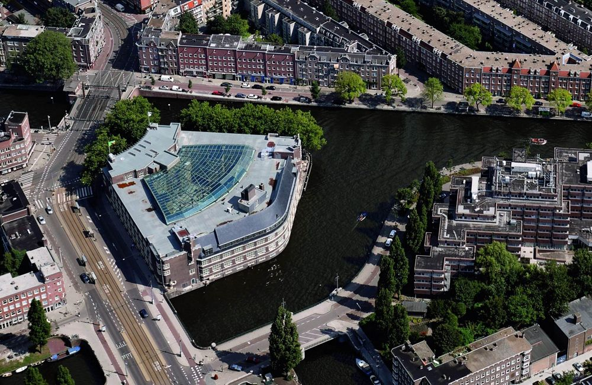

---
# Feel free to add content and custom Front Matter to this file.
# To modify the layout, see https://jekyllrb.com/docs/themes/#overriding-theme-defaults

layout: home
title: Perl and Raku Conference in Amsterdam 2020
---

## When

**10-14 August.**

## Learn
**Monday and Tuesday there will be workshops**. New this year, **a beginner workshop will be included in the price of the standard
conference ticket**. Other more advanced workshops are also planned for Monday and Tuesday in line with previous conferences.

We’ll have dozens of sessions on a great variety of topics. Don’t forget to sign up for one of our great all-day tutorials to engage in some deep learning.

## Listen

Attend great presentations from all parts of the Perl community, including luminaries like Damian Conway. Other keynote speakers yet to be announced. **Presentations and talks will be Wednesday through Friday**.

## Connect

Meet your fellow Perl programmers. **We expect nearly 300 Perlers to attend from around Europe and the world!** This is a great opportunity to connect with the community.

## Save

As a community-organized conference, we pride ourselves on keeping this event affordable.

## Explore

The conference will take place in the city of Amsterdam at the beautiful Het Sieraad.

